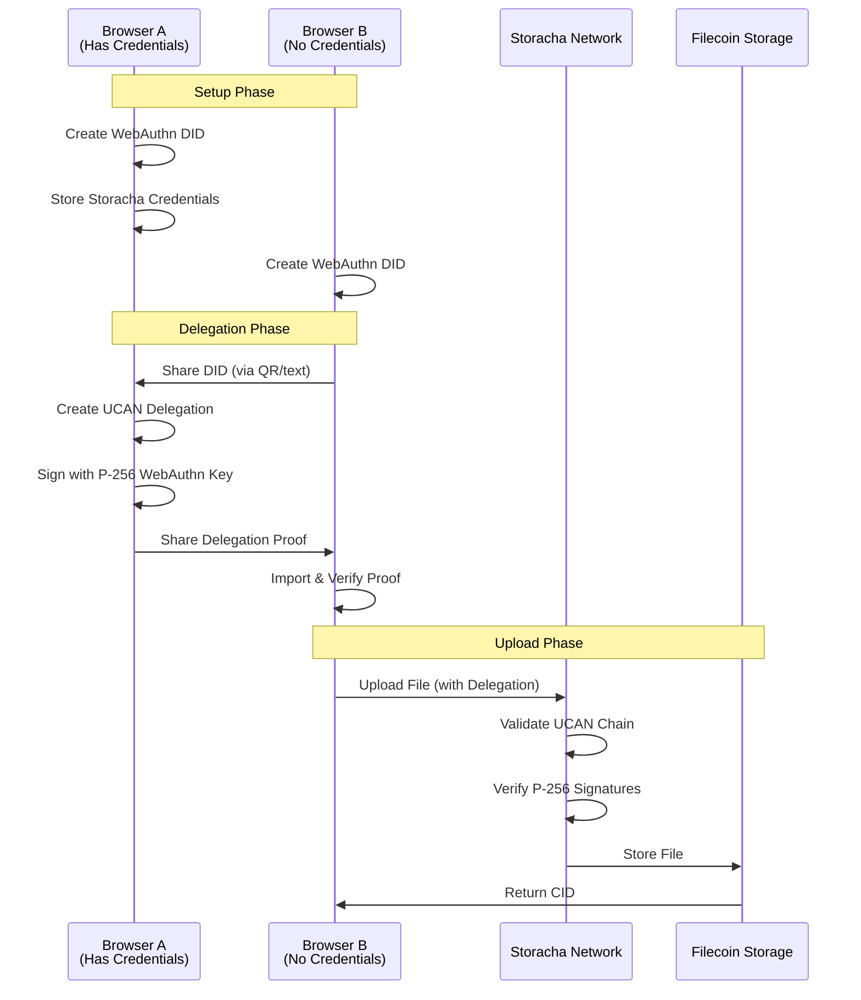

# 🔐 UCAN Upload Wall

**A revolutionary browser-only file upload application powered by WebAuthn DIDs and User-Controlled Authorization Networks (UCANs)**

Upload files to decentralized storage without API keys, servers, or centralized authentication. This app demonstrates the future of web applications: **fully decentralized, hardware-secured, and serverless**.

---

## 🌟 What Makes This Special?

### 🔑 **Browser-Only WebAuthn DID Authentication**
- **No passwords or usernames** - authenticate with your device's biometric sensors (Face ID, Touch ID, Windows Hello)
- **Hardware-secured identity** - your private keys are stored in your device's secure hardware
- **P-256 elliptic curve cryptography** - industry-standard security used by banks and governments
- **Deterministic DID generation** - same identity across browser sessions with the same authenticator

### 🌉 **UCAN Delegation System**
- **Delegate upload permissions** between different browsers/devices without sharing credentials
- **Granular capabilities** - specify exactly what actions are allowed (upload, list, etc.)
- **Cryptographic proof chains** - every action is verifiable through mathematical proofs
- **Zero-knowledge sharing** - delegate permissions without revealing your private keys

### ☁️ **True Decentralization**
- **Filecoin storage** - files are permanently stored on the decentralized web
- **IPFS addressing** - every file gets a unique, immutable content identifier (CID)
- **No backend required** - the entire app runs in your browser
- **Censorship resistant** - no single point of failure or control

---

## 🎯 Problem Solved

**Traditional Challenge**: Web applications require centralized servers, API keys, and database authentication. Users must trust third parties with their data and identity.

**Our Solution**: A completely decentralized application where:
- Your identity is secured by your device's hardware
- File storage is distributed across the Filecoin network
- Permissions can be delegated cryptographically without sharing secrets
- No servers, databases, or API keys are needed

---

## 🔧 Key Features

### 🛡️ **Biometric Authentication**
```
Face ID / Touch ID → WebAuthn Credential → P-256 Private Key → DID Identity
```
- Authenticate using your device's built-in biometric sensors
- Keys are stored in secure hardware enclaves (TEE/Secure Element)
- Works across Chrome, Safari, Firefox, and Edge

### 📤 **Decentralized File Upload**
- Drag & drop files directly from your device
- Files are encrypted and stored on Filecoin via Storacha Network
- Each file gets a permanent, immutable content identifier (CID)
- Access files through IPFS gateways worldwide

### 🤝 **Permission Delegation**
- **Browser A** (has Storacha credentials): Creates delegation for Browser B
- **Browser B** (no credentials needed): Receives delegation and can upload files
- Delegation includes specific capabilities (upload, list, time limits)
- All permissions are cryptographically verifiable

### 📱 **Cross-Device Support**
- Use the same DID identity across multiple browser sessions
- Delegate permissions to your other devices
- Works on desktop, mobile, and tablet browsers

---

## 🏗️ Architecture

### **Component Overview**

```
┌─────────────────────────────────────────────────────────────┐
│                    Browser Frontend                         │
│                  (React + TypeScript)                       │
│                                                             │
│  ┌─────────────────┐  ┌──────────────────────────────────┐ │
│  │ WebAuthn DID    │  │     UCAN Delegation              │ │
│  │ Provider        │  │     Service                      │ │
│  │                 │  │                                  │ │
│  │ • P-256 Keys    │  │ • Create Delegations             │ │
│  │ • Biometric     │  │ • Import Proofs                  │ │
│  │ • Hardware TEE  │  │ • Manage Capabilities            │ │
│  └─────────────────┘  └──────────────────────────────────┘ │
│                                                             │
│  ┌─────────────────────────────────────────────────────────┐ │
│  │              Storacha Client                            │ │
│  │         (Direct Browser Integration)                    │ │
│  └─────────────────────────────────────────────────────────┘ │
└──────────────────────┬──────────────────────────────────────┘
                       │
                       │ UCAN Invocation
                       ▼
┌─────────────────────────────────────────────────────────────┐
│                   Storacha Network                          │
│                                                             │
│  1. Validate UCAN proof chain                               │
│  2. Verify cryptographic signatures                         │
│  3. Check capability permissions                            │
│  4. Execute authorized actions                              │
└──────────────────────┬──────────────────────────────────────┘
                       │
                       │ Store File
                       ▼
┌─────────────────────────────────────────────────────────────┐
│                  Filecoin Network                           │
│              (Permanent Storage)                            │
│                                                             │
│           Returns: CID (Content Identifier)                 │
└─────────────────────────────────────────────────────────────┘
```

### **UCAN Delegation Flow**



---

## 🚀 Getting Started

### Prerequisites

- Modern browser with WebAuthn support (Chrome, Firefox, Safari, Edge)
- Device with biometric authentication (recommended) or security key
- Storacha account and credentials (for initial setup)

### Quick Start

1. **Clone and Install**
   ```bash
   git clone https://github.com/your-username/ucan-upload-wall.git
   cd ucan-upload-wall
   
   # Install frontend dependencies
   cd web
   npm install
   
   # Install server dependencies (optional)
   cd ../server
   npm install
   ```

2. **Start Frontend**
   ```bash
   cd web
   npm run dev
   ```
   Open http://localhost:5173

3. **Setup Authentication**
   - Click "Authenticate with Biometric"
   - Use Face ID, Touch ID, or Windows Hello
   - Your DID will be generated and stored securely

4. **Add Storacha Credentials** (Browser A only)
   ```
   Private Key: [Your Storacha EdDSA private key]
   Space Proof: [Your space delegation CAR file]
   Space DID: [Your space DID identifier]
   ```

5. **Start Uploading**
   - Drag & drop files or click to browse
   - Files are uploaded directly to Filecoin
   - Get permanent CID links for sharing

---

## 🔄 How It Works

### 1. **WebAuthn DID Creation**
```typescript
// Device biometric authentication
const credential = await navigator.credentials.create({
  publicKey: {
    challenge: crypto.getRandomValues(new Uint8Array(32)),
    rp: { name: 'UCAN Upload Wall', id: domain },
    user: { id: userIdBytes, name: userId, displayName },
    pubKeyCredParams: [{ alg: -7, type: 'public-key' }], // P-256
    authenticatorSelection: {
      authenticatorAttachment: 'platform',
      userVerification: 'required'
    }
  }
});

// Extract P-256 public key and create DID
const publicKey = extractPublicKey(credential);
const did = createDID(publicKey); // did:key:zDna...
```

### 2. **UCAN Delegation Creation**
```typescript
// Browser A creates delegation for Browser B
const delegation = await Delegation.delegate({
  issuer: browserA_P256_DID,     // Your WebAuthn DID
  audience: browserB_P256_DID,   // Target browser's DID
  capabilities: [
    { with: spaceDID, can: 'space/blob/add' },
    { with: spaceDID, can: 'store/add' },
    { with: spaceDID, can: 'upload/add' }
  ],
  expiration: Math.floor(Date.now() / 1000) + (30 * 24 * 60 * 60), // 30 days
  proofs: [storachaSpaceProof] // Chain from your Storacha space
});

// Sign with WebAuthn P-256 key
const signedDelegation = await delegation.sign(browserA_signer);
```

### 3. **File Upload with Delegation**
```typescript
// Browser B uploads using received delegation
const client = await StorachaClient.create({
  principal: browserB_P256_DID,
  store: new StoreMemory(),
  proofs: [importedDelegation] // Proof from Browser A
});

const file = new File([fileData], 'example.txt');
const result = await client.upload(file);
console.log('File CID:', result.cid); // bafybeig...
```

---

## 💡 Use Cases

### **1. Personal File Backup**
- Backup files from multiple devices using one Storacha account
- Each device gets its own WebAuthn DID
- Delegate upload permissions without sharing credentials

### **2. Team File Sharing**
- Team admin sets up Storacha space
- Delegates permissions to team members' DIDs
- Members upload files without knowing admin's private keys

### **3. Temporary Access**
- Create time-limited delegations for contractors/guests
- Automatic expiration prevents unauthorized future access
- Revokable permissions for enhanced security

### **4. Cross-Platform Development**
- Test applications across different browsers/devices
- Each environment gets its own DID
- Seamless file sharing during development

---

## 🔒 Security Features

### **Hardware Security**
- Private keys stored in device's Trusted Execution Environment (TEE)
- Keys cannot be extracted or copied
- Biometric authentication required for each signature

### **Cryptographic Proofs**
- All permissions are mathematically verifiable
- UCAN chains provide audit trails
- No need to trust centralized servers

### **Zero-Knowledge Delegation**
- Share permissions without sharing secrets
- Each delegation has specific capabilities and expiration
- Recipient can prove authorization without revealing delegator's keys

### **Filecoin Permanence**
- Files are replicated across multiple storage providers
- Cryptographic proof of storage
- Content-addressed via IPFS for global availability

---

## 🛠️ Development

### **Project Structure**
```
ucan-upload-wall/
├── web/                           # React frontend
│   ├── src/
│   │   ├── components/
│   │   │   ├── Setup.tsx          # WebAuthn & credentials setup
│   │   │   ├── UploadZone.tsx     # Drag & drop file upload
│   │   │   ├── DelegationTab.tsx  # Create & manage delegations
│   │   │   └── FileList.tsx       # Display uploaded files
│   │   │
│   │   ├── lib/
│   │   │   ├── webauthn-did.ts    # WebAuthn DID provider
│   │   │   └── ucan-delegation.ts # UCAN delegation service
│   │   │
│   │   └── hooks/
│   │       └── useFileUpload.ts   # Upload logic & state
│   │
├── server/                        # Optional Express server
└── README.md                      # This file
```

### **Key Technologies**
- **Frontend**: React, TypeScript, Tailwind CSS, Vite
- **Authentication**: WebAuthn, P-256 ECDSA
- **Storage**: Storacha Client, IPFS, Filecoin
- **Cryptography**: UCAN, CAR files, Multiformats
- **UI**: Lucide React icons, responsive design

### **Building**
```bash
# Development
npm run dev

# Production build
npm run build

# Type checking
npm run typecheck
```

---

## 🌐 Browser Compatibility

| Browser | WebAuthn | Platform Auth | Status |
|---------|----------|---------------|--------|
| Chrome 67+ | ✅ | ✅ | Fully Supported |
| Firefox 60+ | ✅ | ✅ | Fully Supported |
| Safari 14+ | ✅ | ✅ | Fully Supported |
| Edge 18+ | ✅ | ✅ | Fully Supported |

**Platform Authenticators:**
- **iOS**: Face ID, Touch ID
- **macOS**: Touch ID, Apple Watch
- **Windows**: Windows Hello (fingerprint, face, PIN)
- **Android**: Fingerprint, Face Unlock

---

## 📚 Learn More

### **UCAN & Decentralized Identity**
- [UCAN Specification](https://github.com/ucan-wg/spec)
- [WebAuthn Guide](https://webauthn.guide/)
- [DID Core Specification](https://www.w3.org/TR/did-core/)

### **Filecoin & IPFS**
- [Storacha Documentation](https://docs.storacha.network/)
- [Filecoin Documentation](https://docs.filecoin.io/)
- [IPFS Documentation](https://docs.ipfs.tech/)

### **Cryptography**
- [P-256 Elliptic Curve](https://nvlpubs.nist.gov/nistpubs/FIPS/NIST.FIPS.186-4.pdf)
- [CAR File Format](https://ipld.io/specs/transport/car/)
- [Multiformats](https://multiformats.io/)

---

## 🤝 Contributing

We welcome contributions! This project demonstrates cutting-edge web technologies:

1. **Fork the repository**
2. **Create a feature branch** (`git checkout -b feature/amazing-feature`)
3. **Test thoroughly** (especially cross-browser WebAuthn compatibility)
4. **Commit your changes** (`git commit -m 'Add amazing feature'`)
5. **Push to the branch** (`git push origin feature/amazing-feature`)
6. **Open a Pull Request**

### **Areas for Contribution**
- Mobile browser optimization
- Additional authenticator support
- Enhanced delegation UI
- Performance improvements
- Documentation & tutorials

---

## 📄 License

This project is licensed under the MIT License - see the [LICENSE](LICENSE) file for details.

---

## 🏆 Acknowledgments

- **Storacha Team** for pioneering UCAN-based decentralized storage
- **UCAN Working Group** for the authorization network specification
- **WebAuthn Community** for passwordless authentication standards
- **IPFS & Filecoin** projects for decentralized storage infrastructure
- **Web3 Storage** for making decentralized storage accessible

---

## 🔮 Future Vision

This application represents the future of web development:

- **No servers** - applications run entirely in browsers
- **No databases** - data is stored on decentralized networks
- **No passwords** - authentication uses device hardware
- **No API keys** - permissions are cryptographically delegated
- **No vendor lock-in** - standards-based protocols ensure interoperability

**Welcome to the decentralized web.** 🌐✨

