# UCAN Upload Wall - Complete Architecture Flow

This document provides a detailed visual representation of the entire UCAN Upload Wall architecture, showing the integration of WebAuthn PRF, Web Worker Ed25519 keystore, DID generation, and UCAN delegation system.

## Table of Contents

- [UCAN Upload Wall - Complete Architecture Flow](#ucan-upload-wall---complete-architecture-flow)
  - [Table of Contents](#table-of-contents)
  - [High-Level Architecture](#high-level-architecture)
  - [WebAuthn Authentication \& PRF Flow](#webauthn-authentication--prf-flow)
  - [Ed25519 Keystore Worker Flow](#ed25519-keystore-worker-flow)
  - [DID Generation Flow](#did-generation-flow)
  - [UCAN Delegation Creation Flow](#ucan-delegation-creation-flow)
  - [UCAN Delegation Import Flow](#ucan-delegation-import-flow)
  - [File Upload Flow](#file-upload-flow)
  - [Revocation Flow](#revocation-flow)
  - [Complete End-to-End Flow](#complete-end-to-end-flow)
  - [Key Security Points](#key-security-points)
    - [🔐 WebAuthn Security](#-webauthn-security)
    - [🔒 Worker Isolation](#-worker-isolation)
    - [⚠️ Known Limitations](#️-known-limitations)
    - [🛡️ UCAN Security](#️-ucan-security)
  - [Technology Stack](#technology-stack)
    - [Core Libraries](#core-libraries)
    - [Cryptography](#cryptography)
    - [Storage](#storage)
    - [Development](#development)
  - [References](#references)
  - [License](#license)

---

## High-Level Architecture


---

## WebAuthn Authentication & PRF Flow


---

## Ed25519 Keystore Worker Flow

```mermaid
sequenceDiagram
    participant Main as Main Thread<br/>(secure-ed25519-did.ts)
    participant Worker as Web Worker<br/>(ed25519-keystore.worker.ts)
    participant WebCrypto as Web Crypto API
    participant LocalStorage as localStorage

    Note over Main,Worker: 🔐 Initialization Phase
    
    Main->>Worker: init({ prfSeed: Uint8Array(32) })
    Note over Main: PRF seed from WebAuthn<br/>(never stored in localStorage)
    
    Worker->>Worker: Import prfSeed as CryptoKey
    Worker->>WebCrypto: crypto.subtle.importKey(<br/>  'raw', prfSeed,<br/>  { name: 'HKDF' }<br/>)
    WebCrypto-->>Worker: CryptoKey (prfKey)
    
    Worker->>WebCrypto: crypto.subtle.deriveKey(<br/>  {<br/>    name: 'HKDF',<br/>    hash: 'SHA-256',<br/>    salt: new Uint8Array(32), ← fixed salt<br/>    info: new TextEncoder().encode('aes-gcm-key')<br/>  },<br/>  prfKey,<br/>  { name: 'AES-GCM', length: 256 },<br/>  false, ← non-extractable!<br/>  ['encrypt', 'decrypt']<br/>)
    WebCrypto-->>Worker: CryptoKey (aesKey)
    Note over Worker: AES key stored in worker memory<br/>Never leaves worker, non-extractable
    
    Worker-->>Main: ✅ Initialized

    Note over Main,Worker: 🔑 Ed25519 Keypair Generation
    
    Main->>Worker: generateKeypair()
    
    Worker->>WebCrypto: crypto.subtle.generateKey(<br/>  { name: 'Ed25519' },<br/>  true, ← extractable for export<br/>  ['sign', 'verify']<br/>)
    WebCrypto-->>Worker: CryptoKeyPair { publicKey, privateKey }
    
    Worker->>WebCrypto: crypto.subtle.exportKey('spki', publicKey)
    WebCrypto-->>Worker: ArrayBuffer (SPKI format)
    Worker->>Worker: Extract raw 32-byte public key
    
    Worker->>WebCrypto: crypto.subtle.exportKey('pkcs8', privateKey)
    WebCrypto-->>Worker: ArrayBuffer (PKCS8 format)
    Worker->>Worker: Extract raw 32-byte private key
    
    Worker->>Worker: Create Ed25519Signer archive:<br/>{<br/>  id: "did:key:z6Mk...",<br/>  keys: {<br/>    "did:key:z6Mk...": privateKeyBytes<br/>  }<br/>}
    Note over Worker: Archive format compatible<br/>with @ucanto/principal/ed25519
    
    Worker->>Worker: Store keys in worker memory
    Note over Worker: privateKey never leaves worker<br/>(except encrypted in archive)
    
    Worker-->>Main: {<br/>  publicKey: Uint8Array(32),<br/>  archive: ArrayBuffer<br/>}

    Note over Main,Worker: 🔒 Archive Encryption & Storage
    
    Main->>Main: createEd25519DID(publicKey)<br/>→ did:key:z6Mk...
    
    Main->>Worker: encrypt({ plaintext: archive })
    Worker->>WebCrypto: crypto.subtle.encrypt(<br/>  {<br/>    name: 'AES-GCM',<br/>    iv: crypto.getRandomValues(new Uint8Array(12))<br/>  },<br/>  aesKey, ← from HKDF<br/>  plaintext<br/>)
    WebCrypto-->>Worker: ArrayBuffer (ciphertext)
    Worker-->>Main: {<br/>  ciphertext: Uint8Array,<br/>  iv: Uint8Array(12)<br/>}
    
    Main->>Main: Convert to hex strings
    Main->>LocalStorage: Store encrypted archive:<br/>{<br/>  ciphertext: "hex...",<br/>  iv: "hex..."<br/>}
    Main->>LocalStorage: Store public info:<br/>{<br/>  publicKey: "hex...",<br/>  did: "did:key:z6Mk..."<br/>}

    Note over Main,Worker: 🔓 Archive Decryption & Restoration
    
    LocalStorage-->>Main: Load encrypted archive
    Main->>Main: Convert hex to Uint8Array
    
    Main->>Worker: decrypt({<br/>  ciphertext: Uint8Array,<br/>  iv: Uint8Array<br/>})
    Worker->>WebCrypto: crypto.subtle.decrypt(<br/>  {<br/>    name: 'AES-GCM',<br/>    iv: iv<br/>  },<br/>  aesKey, ← from HKDF<br/>  ciphertext<br/>)
    WebCrypto-->>Worker: ArrayBuffer (archive)
    Worker-->>Main: { plaintext: ArrayBuffer }
    
    Main->>Main: Parse archive JSON:<br/>{<br/>  id: "did:key:z6Mk...",<br/>  keys: {<br/>    "did:key:z6Mk...": Uint8Array<br/>  }<br/>}
    
    Main->>Main: Create Ed25519Principal.from(archive)
    Note over Main: Now have full Ed25519Signer<br/>for UCAN operations

    Note over Main,Worker: ✍️ Signing Operations
    
    Main->>Worker: sign({ data: Uint8Array })
    Worker->>Worker: Retrieve privateKey from memory
    Worker->>WebCrypto: crypto.subtle.sign(<br/>  'Ed25519',<br/>  privateKey,<br/>  data<br/>)
    WebCrypto-->>Worker: ArrayBuffer (signature)
    Worker-->>Main: { signature: Uint8Array(64) }
```



---

## DID Generation Flow

```mermaid
graph TB
    subgraph "P-256 DID Generation (WebAuthn)"
        P256Start[WebAuthn P-256 Public Key<br/>33 bytes compressed]
        P256Decompress[Decompress to<br/>x: 32 bytes, y: 32 bytes]
        P256Uncompressed[Uncompressed Point<br/>0x04 + x + y<br/>65 bytes]
        P256Multicodec[Add Multicodec Prefix<br/>0x1200 = P-256 public key<br/>[0x80, 0x24]]
        P256Multikey[Multikey<br/>multicodec + uncompressed<br/>67 bytes]
        P256Base58[Base58btc Encode<br/>base58btc.encode(multikey)]
        P256DID["did:key:zDna...<br/>(91 chars)"]
        
        P256Start --> P256Decompress
        P256Decompress --> P256Uncompressed
        P256Uncompressed --> P256Multicodec
        P256Multicodec --> P256Multikey
        P256Multikey --> P256Base58
        P256Base58 --> P256DID
    end
    
    subgraph "Ed25519 DID Generation (Worker)"
        Ed25519Start[Ed25519 Public Key<br/>32 bytes]
        Ed25519Multicodec[Add Multicodec Prefix<br/>0xed = Ed25519 public key<br/>[0xed, 0x01]]
        Ed25519Multikey[Multikey<br/>multicodec + publicKey<br/>34 bytes]
        Ed25519Base58[Base58btc Encode<br/>base58btc.encode(multikey)]
        Ed25519DID["did:key:z6Mk...<br/>(48 chars)"]
        
        Ed25519Start --> Ed25519Multicodec
        Ed25519Multicodec --> Ed25519Multikey
        Ed25519Multikey --> Ed25519Base58
        Ed25519Base58 --> Ed25519DID
    end
    
    subgraph "Usage"
        P256DID -->|Authentication<br/>Delegation Verification| WebAuthnOps[WebAuthn Operations<br/>Did NOT used for UCAN signing]
        Ed25519DID -->|UCAN Signing<br/>Delegation Creation| UCANOps[UCAN Operations<br/>Storacha Client Principal]
    end

    style P256DID fill:#e1f5ff
    style Ed25519DID fill:#e1ffe1
    style WebAuthnOps fill:#ffe1e1
    style UCANOps fill:#ffe1e1
```

---

## UCAN Delegation Creation Flow

```mermaid
sequenceDiagram
    participant User
    participant UI as DelegationManager UI
    participant Service as UCANDelegationService
    participant Worker as Ed25519 Keystore Worker
    participant Ucanto as @ucanto/core
    participant Storage as localStorage

    User->>UI: Click "Create Delegation"
    UI->>UI: Enter target DID, capabilities, expiration
    User->>UI: Click "Create"
    
    UI->>Service: createDelegation(<br/>  toDid: "did:key:z6Mk...",<br/>  capabilities: ["upload/add", "store/add", ...],<br/>  expirationHours: 24<br/>)
    
    alt Has Storacha Credentials (Browser A)
        Service->>Service: Get stored credentials
        Service->>Service: Parse issuer from credentials.key<br/>→ EdDSA Signer
        Service->>Service: Get spaceDid from credentials
        Note over Service: Direct delegation from<br/>Storacha account
        
    else Has Received Delegation (Browser B - Chaining)
        Service->>Service: Find suitable received delegation<br/>with required capabilities
        Service->>Service: Parse received delegation proof
        Service->>Service: Extract spaceDid from delegation
        Service->>Worker: Get worker Ed25519 principal
        Worker->>Worker: Retrieve keys from memory
        Worker-->>Service: Ed25519 Signer (issuer)
        Note over Service: Chained delegation from<br/>received delegation
    end
    
    Service->>Service: Calculate expiration timestamp:<br/>now + (expirationHours * 3600)
    
    Service->>Ucanto: Verifier.parse(toDid)
    Ucanto-->>Service: targetVerifier
    
    Service->>Service: Build capabilities:<br/>[{<br/>  with: spaceDid,<br/>  can: "upload/add"<br/>}, ...]
    
    Service->>Ucanto: delegate({<br/>  issuer: Ed25519Signer,<br/>  audience: targetVerifier,<br/>  capabilities: [...],<br/>  expiration: timestamp,<br/>  proofs: [receivedDelegation] ← if chaining<br/>})
    
    Ucanto->>Worker: issuer.sign(delegation_data)
    Worker->>Worker: Sign with Ed25519 private key
    Worker-->>Ucanto: signature
    
    Ucanto->>Ucanto: Create UCAN token:<br/>{<br/>  header: { alg: "EdDSA", typ: "JWT" },<br/>  payload: {<br/>    iss: issuer_did,<br/>    aud: audience_did,<br/>    att: capabilities,<br/>    exp: expiration,<br/>    prf: [proof_cids]<br/>  },<br/>  signature: base64url(signature)<br/>}
    
    Ucanto-->>Service: Delegation object
    
    Service->>Ucanto: delegation.archive()
    Ucanto->>Ucanto: Encode to CAR format<br/>(Content Addressable aRchive)
    Ucanto-->>Service: carBytes: Uint8Array
    
    Service->>Service: Encode to base64:<br/>btoa(String.fromCharCode(...carBytes))
    Service->>Service: Add multibase prefix:<br/>'m' + base64
    Note over Service: Result: "mSomeBase64EncodedCAR..."<br/>Compatible with Storacha CLI format
    
    Service->>Service: Create DelegationInfo:<br/>{<br/>  id: delegation.cid,<br/>  fromIssuer: issuer.did(),<br/>  toAudience: toDid,<br/>  proof: multibase_string,<br/>  capabilities: [...],<br/>  createdAt: ISO_timestamp,<br/>  expiresAt: ISO_timestamp<br/>}
    
    Service->>Storage: Store in created_delegations
    
    Service-->>UI: multibase_proof_string
    UI->>UI: Display proof in textarea
    UI->>User: Show "Copy to Clipboard" button
    
    User->>UI: Click "Copy"
    UI->>User: ✅ Delegation proof copied!<br/>Share this with recipient
```



---

## UCAN Delegation Import Flow

```mermaid
sequenceDiagram
    participant User
    participant UI as DelegationManager UI
    participant Service as UCANDelegationService
    participant Worker as Ed25519 Keystore Worker
    participant Ucanto as @ucanto/core/delegation
    participant StorachaProof as @storacha/client/proof
    participant Storage as localStorage

    User->>UI: Paste delegation proof
    User->>UI: Click "Import Delegation"
    
    UI->>Service: importDelegation(proofString, name?)
    
    Service->>Service: Ensure Ed25519 DID exists:<br/>getCurrentDID()
    
    alt No DID Yet
        Service->>Worker: initializeEd25519DID()
        Note over Service,Worker: Triggers WebAuthn authentication
        Worker-->>Service: Ed25519 DID created
    end
    
    Service->>Service: Clean proof string:<br/>trim(), remove whitespace/newlines
    
    Service->>Service: Detect format from prefix
    
    alt Starts with 'm' (base64)
        Note over Service: Storacha CLI format<br/>multibase base64
        Service->>Service: Remove 'm' prefix
        Service->>Service: Decode base64 → Uint8Array
        
    else Starts with 'u' (base64url)
        Note over Service: App-created format<br/>multibase base64url
        Service->>Service: Remove 'u' prefix
        Service->>Service: Convert base64url → base64
        Service->>Service: Decode base64 → Uint8Array
        
    else No multibase prefix
        Note over Service: Legacy format
        Service->>Service: Treat as raw text
    end
    
    Service->>Service: Try parsing methods in priority order:
    
    Note over Service,Ucanto: Priority 1: ucanto extract()
    Service->>Ucanto: extract(tokenBytes)
    
    alt ucanto extract succeeds
        Ucanto->>Ucanto: Parse CAR format
        Ucanto->>Ucanto: Extract UCAN blocks
        Ucanto->>Ucanto: Verify signatures
        Ucanto-->>Service: {<br/>  ok: Delegation {<br/>    issuer, audience, capabilities,<br/>    expiration, cid<br/>  }<br/>}
        Note over Service: Format: "ucanto extract"
        
    else ucanto extract fails
        Note over Service,StorachaProof: Priority 2: Storacha Proof.parse()
        Service->>StorachaProof: Proof.parse(cleanedProof)
        StorachaProof->>StorachaProof: Parse multibase string
        StorachaProof->>StorachaProof: Decode CAR format
        StorachaProof->>StorachaProof: Extract delegation
        StorachaProof-->>Service: Delegation object
        Note over Service: Format: "Storacha CLI"
        
    else Both fail
        Service->>Service: Try legacy JSON format
        Service->>Service: base64ToArrayBuffer(proof)
        Service->>Service: JSON.parse(decoded)
        Note over Service: Format: "legacy JSON"
    end
    
    Service->>Service: Extract delegation details:<br/>issuer = delegation.issuer.did()<br/>audience = delegation.audience.did()<br/>capabilities = delegation.capabilities.map(c => c.can)
    
    Service->>Service: Verify audience matches our DID
    
    alt Audience mismatch
        Service-->>UI: ❌ Error: "Delegation not for your DID"
        UI->>User: Show error with details:<br/>Expected: did:key:z6Mk...<br/>Got: did:key:z6Mk...(different)
        Note over User: User must request new<br/>delegation for correct DID
        
    else Audience matches
        Service->>Service: Create DelegationInfo:<br/>{<br/>  id: delegation.cid.toString(),<br/>  name: name || auto-generated,<br/>  fromIssuer: issuer,<br/>  toAudience: audience,<br/>  proof: cleanedProof,<br/>  capabilities: [...],<br/>  createdAt: now,<br/>  expiresAt: expiration,<br/>  format: detected_format<br/>}
        
        Service->>Storage: Check if already exists
        
        alt Already exists
            Service-->>UI: ❌ Error: "Already imported"
            
        else New delegation
            Service->>Storage: Store in received_delegations:<br/>JSON.stringify([delegationInfo, ...existing])
            Service-->>UI: ✅ Success
            UI->>User: "Delegation imported successfully!"<br/>Show delegation details
        end
    end
```



---

## File Upload Flow

```mermaid
sequenceDiagram
    participant User
    participant UI as UploadZone UI
    participant Service as UCANDelegationService
    participant Worker as Ed25519 Keystore Worker
    participant Client as @storacha/client
    participant API as Storacha API<br/>up.storacha.network
    participant IPFS as IPFS/Filecoin Network

    User->>UI: Drag & drop file or click to select
    UI->>UI: Show file details (name, size, type)
    User->>UI: Click "Upload"
    
    UI->>Service: uploadFile(file)
    
    Service->>Service: Check permissions:<br/>- Has Storacha credentials?<br/>- Has delegation with upload capability?
    
    alt Has Storacha Credentials (Browser A)
        Service->>Service: Use stored credentials
        Service->>Client: Get existing Storacha client
        Note over Service: Direct upload using<br/>Storacha account
        
    else Has Upload Delegation (Browser B)
        Service->>Service: Find delegation with capabilities:<br/>- upload/add OR upload/*<br/>- store/add OR store/*<br/>- space/blob/add OR space/*
        
        alt No upload delegation found
            Service-->>UI: ❌ Error: "No upload permissions"
            UI->>User: Show error message
            Note over User: User needs to import<br/>delegation with upload capability
        end
        
        Service->>Service: Check delegation validity
        Service->>API: GET /revocations/{delegation.id}
        
        alt Delegation revoked
            API-->>Service: 200 OK { revoked: true }
            Service-->>UI: ❌ Error: "Delegation revoked"
            UI->>User: Show error
            
        else Delegation expired
            Service->>Service: Check expiration timestamp
            Service-->>UI: ❌ Error: "Delegation expired"
            UI->>User: Show error
            
        else Delegation valid
            API-->>Service: 404 Not Found (not revoked)
            
            Service->>Worker: getWorkerPrincipal()
            Worker->>Worker: Retrieve Ed25519 keys from memory
            Worker-->>Service: Ed25519Signer
            
            Service->>Service: Parse delegation proof
            Service->>Client: Client.create({<br/>  principal: Ed25519Signer,<br/>  store: StoreMemory<br/>})
            Client-->>Service: client instance
            
            Service->>Service: Extract spaceDid from delegation
            Service->>Client: client.addSpace(delegation)
            Client-->>Service: space
            Service->>Client: client.setCurrentSpace(space.did())
            Note over Service: Client configured with<br/>delegation permissions
        end
    end
    
    Service->>Service: Convert File to Blob:<br/>new Blob([await file.arrayBuffer()])
    
    Service->>Client: client.uploadFile(blob)
    
    Client->>Client: Process file:<br/>1. Compute CID (content addressing)<br/>2. Create CAR (Content Addressable aRchive)<br/>3. Split into shards if large
    
    Client->>Worker: Sign upload request with Ed25519
    Worker->>Worker: Sign UCAN invocation:<br/>{<br/>  iss: "did:key:z6Mk...",<br/>  aud: "did:web:up.storacha.network",<br/>  att: [{ with: spaceDid, can: "upload/add" }],<br/>  prf: [delegation_cid]<br/>}
    Worker-->>Client: signature
    
    Client->>API: POST /upload<br/>Headers:<br/>  Authorization: UCAN {token}<br/>Body: CAR file + metadata
    
    API->>API: Verify UCAN:<br/>1. Check signature (Ed25519)<br/>2. Validate delegation chain<br/>3. Check capabilities<br/>4. Verify not expired<br/>5. Check not revoked
    
    alt UCAN invalid
        API-->>Client: 401 Unauthorized
        Client-->>Service: Error
        Service-->>UI: ❌ Upload failed
        
    else UCAN valid
        API->>IPFS: Store file on IPFS/Filecoin
        IPFS->>IPFS: Distribute across network
        IPFS->>IPFS: Pin for persistence
        IPFS-->>API: CID + storage proof
        
        API->>API: Record upload metadata:<br/>- root CID<br/>- shard CIDs<br/>- uploader DID<br/>- timestamp
        
        API-->>Client: 200 OK {<br/>  cid: "bafy...",<br/>  url: "https://dweb.link/ipfs/bafy..."<br/>}
    end
    
    Client-->>Service: { cid: "bafy..." }
    Service-->>UI: { cid: "bafy..." }
    
    UI->>UI: Show success:<br/>✅ File uploaded!<br/>CID: bafy...<br/>Gateway URL: https://dweb.link/ipfs/bafy...
    UI->>User: Display upload result
    
    User->>UI: Click CID or Gateway URL
    UI->>User: Open file in IPFS gateway
```



---

## Revocation Flow

```mermaid
sequenceDiagram
    participant User
    participant UI as DelegationManager UI
    participant Service as UCANDelegationService
    participant Worker as Ed25519 Keystore Worker
    participant Ucanto as @ucanto/core
    participant API as Storacha API<br/>up.storacha.network
    participant Registry as Revocation Registry<br/>up.storacha.network/revocations
    participant Recipient as Recipient Browser

    User->>UI: View created delegations
    UI->>UI: Show list with "Revoke" button
    User->>UI: Click "Revoke" on delegation
    UI->>UI: Show confirmation dialog:<br/>"Are you sure? This cannot be undone."
    User->>UI: Confirm revocation
    
    UI->>Service: revokeDelegation(delegationCID)
    
    Service->>Service: Find delegation in created_delegations
    
    alt Delegation not found
        Service-->>UI: ❌ Error: "Delegation not found"
        
    else Delegation found
        Service->>Service: Parse delegation proof
        Service->>Worker: getWorkerPrincipal()
        Worker-->>Service: Ed25519Signer (issuer)
        
        Service->>Ucanto: Verifier.parse("did:web:up.storacha.network")
        Ucanto-->>Service: serviceID
        
        Service->>Ucanto: invoke({<br/>  issuer: Ed25519Signer,<br/>  audience: serviceID,<br/>  capability: {<br/>    can: "ucan/revoke",<br/>    with: issuer.did(),<br/>    nb: {<br/>      ucan: delegation.cid<br/>    }<br/>  },<br/>  proofs: [parsedDelegation]<br/>})
        
        Ucanto->>Worker: issuer.sign(revocation_data)
        Worker->>Worker: Sign with Ed25519 private key
        Worker-->>Ucanto: signature
        
        Ucanto->>Ucanto: Create revocation UCAN:<br/>{<br/>  iss: "did:key:z6Mk...",<br/>  aud: "did:web:up.storacha.network",<br/>  att: [{<br/>    with: issuer_did,<br/>    can: "ucan/revoke",<br/>    nb: { ucan: delegation_cid }<br/>  }],<br/>  prf: [delegation_cid]<br/>}
        
        Ucanto-->>Service: revocationInvocation
        
        Service->>Ucanto: Create connection to Storacha
        Service->>API: POST https://up.storacha.network<br/>Headers:<br/>  Content-Type: application/car<br/>Body: CAR(revocationInvocation)
        
        API->>API: Verify revocation UCAN:<br/>1. Check signature<br/>2. Verify issuer matches delegation creator<br/>3. Validate delegation proof<br/>4. Check issuer has authority
        
        alt Verification fails
            API-->>Service: Error response
            Service-->>UI: ❌ Revocation failed
            
        else Verification succeeds
            API->>Registry: Store revocation record:<br/>{<br/>  delegation_cid: "bafy...",<br/>  revoked_by: "did:key:z6Mk...",<br/>  revoked_at: timestamp,<br/>  status: "revoked"<br/>}
            
            Registry-->>API: Stored
            API-->>Service: { out: { ok: {} } }
            
            Service->>Service: Update local storage:<br/>delegation.revoked = true<br/>delegation.revokedAt = now<br/>delegation.revokedBy = issuer.did()
            
            Service->>Service: Update revocation cache:<br/>cache[cid] = {<br/>  revoked: true,<br/>  checkedAt: now<br/>}
            
            Service-->>UI: { success: true }
            UI->>UI: Update delegation display:<br/>Show "Revoked" badge
            UI->>User: ✅ Delegation revoked successfully
        end
    end
    
    Note over Recipient,Registry: When recipient tries to use revoked delegation
    
    Recipient->>Service: uploadFile() or other operation
    Service->>Service: validateDelegation(delegation)
    Service->>Registry: GET /revocations/{delegation_cid}
    
    alt Revoked
        Registry-->>Service: 200 OK { revoked: true }
        Service->>Service: Cache result (5 min TTL)
        Service-->>Recipient: ❌ Error: "Delegation has been revoked"
        
    else Not revoked
        Registry-->>Service: 404 Not Found
        Service->>Service: Cache result (5 min TTL)
        Service->>Service: Continue with operation
    end
```



---

## Complete End-to-End Flow

This diagram shows the complete flow from initial setup through file upload for both Browser A (credential owner) and Browser B (delegation recipient).

```mermaid
sequenceDiagram
    participant UserA as User A<br/>(Browser A)
    participant BrowserA as Browser A<br/>(Credential Owner)
    participant UserB as User B<br/>(Browser B)
    participant BrowserB as Browser B<br/>(Delegatee)
    participant Authenticator as Hardware Authenticator
    participant Worker as Web Worker<br/>(Ed25519 Keystore)
    participant Storage as localStorage
    participant Storacha as Storacha Services
    participant IPFS as IPFS/Filecoin

    Note over UserA,IPFS: 🔵 Browser A Setup Phase
    
    UserA->>BrowserA: Open app, click "Authenticate"
    BrowserA->>Authenticator: WebAuthn create credential (P-256 + PRF)
    Authenticator->>UserA: Biometric prompt
    UserA->>Authenticator: Provide biometric
    Authenticator-->>BrowserA: Credential + PRF seed
    BrowserA->>BrowserA: Create P-256 DID: did:key:zDna...
    
    BrowserA->>Worker: init(prfSeed)
    Worker->>Worker: HKDF-SHA-256(prfSeed) → AES key
    Worker-->>BrowserA: ✅ Initialized
    
    BrowserA->>Worker: generateKeypair()
    Worker->>Worker: Generate Ed25519 keypair
    Worker->>Worker: Create Ed25519Signer archive
    Worker-->>BrowserA: publicKey + archive
    BrowserA->>BrowserA: Create Ed25519 DID: did:key:z6Mk...
    
    BrowserA->>Worker: encrypt(archive)
    Worker-->>BrowserA: ciphertext + iv
    BrowserA->>Storage: Store encrypted archive + DID
    
    UserA->>BrowserA: Add Storacha credentials<br/>(key + proof + spaceDid)
    BrowserA->>Storage: Store credentials
    BrowserA->>BrowserA: Initialize Storacha client
    
    Note over BrowserA: ✅ Browser A fully set up<br/>Can upload files directly

    Note over UserA,IPFS: 🟢 Browser A Creates Delegation for Browser B
    
    UserA->>BrowserA: Click "Create Delegation"
    UserB->>BrowserB: Open app, click "Authenticate"
    BrowserB->>Authenticator: WebAuthn create credential
    Authenticator->>UserB: Biometric prompt
    UserB->>Authenticator: Provide biometric
    Authenticator-->>BrowserB: Credential
    BrowserB->>Worker: Generate Ed25519 DID
    Worker-->>BrowserB: did:key:z6Mk...(B)
    UserB->>UserB: Copy Browser B's DID
    
    UserB->>UserA: Share DID (chat/email/QR)
    UserA->>BrowserA: Paste Browser B's DID<br/>Select capabilities<br/>Set expiration
    UserA->>BrowserA: Click "Create Delegation"
    
    BrowserA->>Worker: getWorkerPrincipal()
    Worker-->>BrowserA: Ed25519Signer
    BrowserA->>BrowserA: Create UCAN delegation:<br/>iss: Browser A DID<br/>aud: Browser B DID<br/>att: [upload/*, store/*, ...]<br/>exp: 24h from now
    BrowserA->>Worker: Sign delegation
    Worker-->>BrowserA: signature
    BrowserA->>BrowserA: Archive to CAR format<br/>Encode as multibase base64
    BrowserA->>Storage: Store in created_delegations
    BrowserA->>BrowserA: Display proof string
    
    UserA->>UserA: Copy delegation proof
    UserA->>UserB: Share proof (chat/email)
    
    Note over UserA,IPFS: 🟣 Browser B Imports Delegation
    
    UserB->>BrowserB: Paste delegation proof
    UserB->>BrowserB: Click "Import Delegation"
    
    BrowserB->>BrowserB: Parse proof (try ucanto, then Storacha)
    BrowserB->>BrowserB: Verify audience matches Browser B DID
    BrowserB->>Storage: Store in received_delegations
    BrowserB->>BrowserB: Display delegation details
    
    Note over BrowserB: ✅ Browser B can now upload<br/>using delegated permissions!

    Note over UserA,IPFS: 🟠 Browser A Uploads File (Direct)
    
    UserA->>BrowserA: Drag & drop file
    UserA->>BrowserA: Click "Upload"
    BrowserA->>BrowserA: Use Storacha credentials
    BrowserA->>Storacha: POST /upload<br/>with credentials
    Storacha->>IPFS: Store file
    IPFS-->>Storacha: CID + proof
    Storacha-->>BrowserA: CID: bafy...(A)
    BrowserA->>UserA: ✅ Upload successful!

    Note over UserA,IPFS: 🟡 Browser B Uploads File (Via Delegation)
    
    UserB->>BrowserB: Drag & drop file
    UserB->>BrowserB: Click "Upload"
    
    BrowserB->>BrowserB: Find upload delegation
    BrowserB->>Storacha: Check revocation status
    Storacha-->>BrowserB: Not revoked ✓
    
    BrowserB->>Worker: getWorkerPrincipal()
    Worker-->>BrowserB: Ed25519Signer (Browser B)
    BrowserB->>BrowserB: Parse delegation proof
    BrowserB->>BrowserB: Create Storacha client with delegation
    
    BrowserB->>Worker: Sign upload UCAN:<br/>iss: Browser B DID<br/>aud: did:web:up.storacha.network<br/>att: [{with: spaceDid, can: "upload/add"}]<br/>prf: [delegation_cid]
    Worker-->>BrowserB: signature
    
    BrowserB->>Storacha: POST /upload<br/>with UCAN token + file
    Storacha->>Storacha: Verify UCAN:<br/>✓ Signature valid<br/>✓ Delegation chain valid<br/>✓ Not expired<br/>✓ Not revoked
    Storacha->>IPFS: Store file
    IPFS-->>Storacha: CID + proof
    Storacha-->>BrowserB: CID: bafy...(B)
    BrowserB->>UserB: ✅ Upload successful!
    
    Note over UserB: Browser B uploaded file<br/>WITHOUT Storacha credentials!<br/>Used only delegated permissions ✨

    Note over UserA,IPFS: 🔴 Browser A Revokes Delegation
    
    UserA->>BrowserA: View created delegations
    UserA->>BrowserA: Click "Revoke" on Browser B's delegation
    UserA->>BrowserA: Confirm revocation
    
    BrowserA->>Worker: Sign revocation UCAN:<br/>can: "ucan/revoke"<br/>nb: { ucan: delegation_cid }
    Worker-->>BrowserA: signature
    BrowserA->>Storacha: POST /revocations<br/>with revocation UCAN
    Storacha->>Storacha: Store revocation record
    Storacha-->>BrowserA: ✅ Revoked
    BrowserA->>Storage: Mark delegation as revoked
    BrowserA->>UserA: ✅ Delegation revoked
    
    Note over UserB: Browser B can no longer<br/>use this delegation ❌
    
    UserB->>BrowserB: Try to upload another file
    BrowserB->>Storacha: Check revocation status
    Storacha-->>BrowserB: ❌ Revoked
    BrowserB->>UserB: ❌ Error: Delegation has been revoked
```



---

## Key Security Points

### 🔐 WebAuthn Security
- **Private keys never leave hardware**: P-256 keys stay in TPM/Secure Enclave
- **Biometric-gated**: Every authentication requires biometric verification
- **PRF deterministic**: Same credential + same input = same PRF output
- **PRF seed ephemeral**: Only exists during WebAuthn operation, never persisted

### 🔒 Worker Isolation
- **Ed25519 keys isolated**: Private keys stored only in worker memory
- **Non-extractable AES key**: Derived using Web Crypto API's non-extractable flag
- **Encrypted at rest**: Archives encrypted with AES-GCM before localStorage
- **Re-authentication required**: Every page load requires WebAuthn to decrypt

### ⚠️ Known Limitations
- **Worker not true isolation**: Malicious code in same origin can access worker
- **localStorage accessible**: Same-origin scripts can read encrypted archives
- **JavaScript/WASM memory**: Private keys exist in software memory (not hardware)
- **No security audit**: This is a proof-of-concept, not production-ready

### 🛡️ UCAN Security
- **Cryptographic signatures**: All delegations signed with Ed25519
- **Capability-based**: Fine-grained permissions (upload/add, store/list, etc.)
- **Expiration support**: Time-limited delegations
- **Revocation registry**: Immediate revocation via Storacha service
- **Delegation chains**: Transitive trust with proof verification

---

## Technology Stack

### Core Libraries
- **@ucanto/core** - UCAN delegation protocol
- **@ucanto/principal** - DID and signing principals
- **@storacha/client** - Storacha upload client
- **multiformats** - Multicodec, multibase, CID handling

### Cryptography
- **Web Crypto API** - Ed25519, AES-GCM, HKDF
- **WebAuthn API** - P-256, PRF extension
- **Hardware authenticators** - TPM, Secure Enclave, Windows Hello

### Storage
- **localStorage** - Encrypted archives, delegations
- **IPFS** - Content-addressed storage
- **Filecoin** - Persistent decentralized storage

### Development
- **React** - UI framework
- **TypeScript** - Type-safe development
- **Vite** - Build tool and dev server
- **Web Workers** - Isolated keystore execution

---

## References

- [WebAuthn Level 3 Specification](https://www.w3.org/TR/webauthn-3/)
- [UCAN Specification](https://github.com/ucan-wg/spec)
- [Storacha Documentation](https://docs.storacha.network/)
- [ucanto Library](https://github.com/web3-storage/ucanto)
- [did:key Method](https://w3c-ccg.github.io/did-method-key/)
- [Multicodec Table](https://github.com/multiformats/multicodec/blob/master/table.csv)
- [HKDF (RFC 5869)](https://tools.ietf.org/html/rfc5869)
- [CAR Format](https://ipld.io/specs/transport/car/)

---

## License

MIT License - See [LICENSE](../LICENSE) for details.

